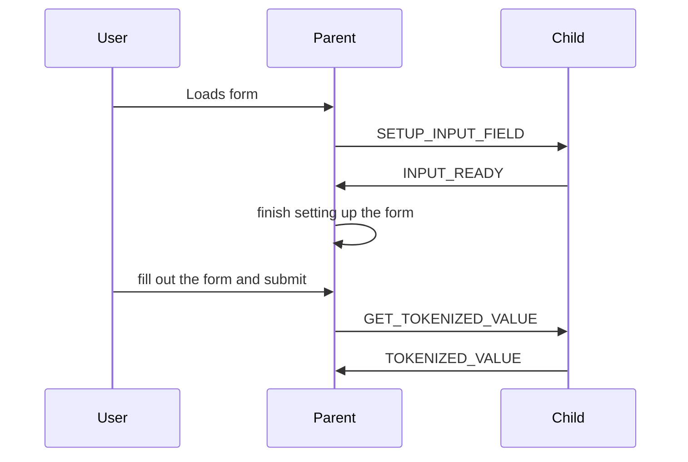
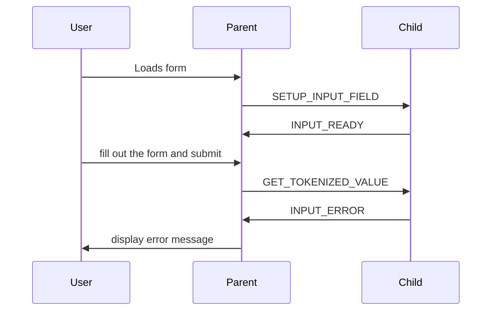
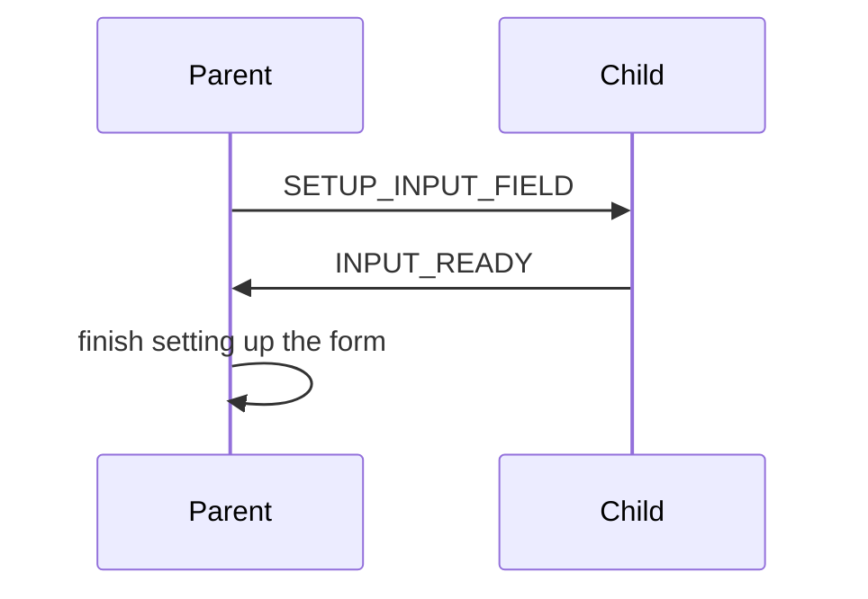

# Encrypted Field

This is a demo of an encrypted field that can be used to securely store and transmit sensitive information.

See demo on live page at:

[http://iframe-testing.garrypolley.com/deployed/parent.html](deployed/parent.html)

# Proposed API

## IFrame API

The primary way this iFrame setup works is two part:

1. Include the `iframe` at `<iframe src="http://childiframe.com:8001/child.html?fieldId=instrument123" height="100%" width="100%"></iframe>`
2. Setup the message passing between the parent and child pages

See the `parent.html` file for an example of how to setup the message passing.

## The Messages

### Child/Encrypted Field Messages

**Message Format:**

All messages are JSON objects with a `type` property and any other data that is needed.

**Out Messages:**

These are the messages that the child page will send to the parent page. These should all be handled by the parent page.

If a call to `GET_TOKENIZED_VALUE` is successful, the child page will send a `TOKENIZED_VALUE` message back to the parent page. If it fails, it will send an `INPUT_ERROR` message back to the parent page.

**Successful Flow:**

**Error Flow:**

* `TOKENIZED_VALUE` - The child page has tokenized the value of the field
  * `type` - Always `TOKENIZED_VALUE`
  * `token` - The tokenized value
* `INPUT_CHANGED` - The user has changed the value of the field
  * `type` - Always `INPUT_CHANGED`
* `INPUT_ERROR` - The user has made an error in the field
  * `type` - Always `INPUT_ERROR`
  * `error` - the error message to display to the user
  * `info` - an object with the following properties from the field's validity object:
    * `patternMismatch`
    * `tooLong`
    * `tooShort`
    * `valueMissing`
    * `rangeOverflow`
    * `rangeUnderflow`
    * `typeMismatch`
    * `badInput`
    * `customError`
* `INPUT_READY` - The child page is ready to receive messages, and input can be used
  * no data, only informing the parent that the field is ready

**In Messages:**

These are the messages that the parent page will send to the child page. These should all be handled by the child page. The body of the message will be the data needed to setup the input field.

Both messages have the `type` property, which is the type of message.

**Flow for setting up the input field:**

* `SETUP_INPUT_FIELD` - The parent page is telling the child page the validation rules for the field
  * `type` - Always `SETUP_INPUT_FIELD`
  * `fieldId` - the id of the field
  * `fieldType` - the type of the field
  * `placeholder` - the placeholder for the field
  * `required` - indicate if the field is required
  * `minLength` - the minimum length of the field
  * `maxLength` - the maximum length of the field
  * `style` - the style for the field
  * `formStyle` - the style for the form, not usually needed
  * `invalidStyle` - the style for the field when it is invalid
  * `validStyle` - the style for the field when it is valid
* `GET_TOKENIZED_VALUE` - The parent page is asking for the tokenized value of the field
  * `type` - Always `GET_TOKENIZED_VALUE`

**EXCHANGE_TOKEN**

# How it works

The parent page contains a form with an encrypted field. The encrypted field is actually an iframe that contains the child page.

## Parent Page

This page contains the form with the encrypted field. When the form is submitted, the parent page will send a message to the child page asking for the tokenized value.

## Child Page

This page contains the iframe with the encrypted field. When the parent page asks for the tokenized value, the child page will fetch the current value of the input and tokenize it. It will then send the tokenized value back to the parent page.

If there are any errors, the child page will send an error message back to the parent page.

# How to run this demo

0. Clone this repo `git clone https://github.com/garry-polley/iframe-testing`
0. Ensure you have python3 installed
0. Ensure you've updated your `/etc/hosts` file to include what's in the `etc_hosts_config` in this repo
0. Open 2 terminal windows
0. In the first run: `python3 -m http.server 8001 --bind childiframe.com`
0. In the second run: `python3 -m http.server 8000 --bind parentiframe.com`
0. Open `http://parentiframe.com:8000/parent.html` in your browser and fill out the form to submit the payment
0. See what's logged to the console in the browser
